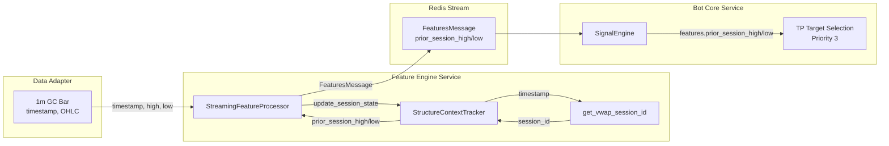

# Session High/Low Tracking Implementation

## Summary

Implemented session high/low tracking in `StructureContextTracker` to populate `prior_session_high` and `prior_session_low` fields, enabling Priority #3 TP target selection in signal generation.

## Problem Solved

Previously, `prior_session_high` and `prior_session_low` were hardcoded to `None` in `structure.py`, causing these TP targets to never be available:

**Signal Engine TP Priority (shorts):**
1. ✅ Untouched liquidity low (HTF)
2. ✅ HTF range low (HTF)
3. ❌ **Prior session low (1m) - Always None**
4. ⚠️ Nearest FVG low (HTF) - Often None
5. ✅ Nearest swing low (1m) - Fallback

**Signal Engine TP Priority (longs):**
1. ✅ Untouched liquidity high (HTF)
2. ✅ HTF range high (HTF)
3. ❌ **Prior session high (1m) - Always None**
4. ⚠️ Nearest FVG high (HTF) - Often None
5. ✅ Nearest swing high (1m) - Fallback

## Session Definition

Sessions run from **08:20 ET to 08:19:59 ET next day**, aligning with Gold futures Regular Trading Hours (RTH) open. This is the institutional standard for intraday analysis.

**Examples:**
- Bar at 08:19 ET on Jan 16 → belongs to Jan 15 session
- Bar at 08:20 ET on Jan 16 → starts Jan 16 session
- Bar at 14:00 ET on Jan 16 → belongs to Jan 16 session
- Bar at 06:00 ET on Jan 17 → belongs to Jan 16 session

## Implementation

### 1. Added Session Tracking State

**File:** [`structure.py`](services/shared/src/scp_shared/indicators/structure.py)

**Location:** `StructureContextTracker.__init__()` (after line 227)

```python
# Session high/low tracking (SOP Section 4.3 - TP Structural Targets Priority #3)
# Sessions run from 08:20 ET to 08:19:59 ET next day (Gold futures RTH open)
self.current_session_id: date | None = None
self.current_session_high: float | None = None
self.current_session_low: float | None = None
self.prior_session_high: float | None = None
self.prior_session_low: float | None = None
```

### 2. Implemented update_session_state() Method

**File:** [`structure.py`](services/shared/src/scp_shared/indicators/structure.py)

**Location:** After `update_volume_state()` method (line 635)

```python
def update_session_state(self, timestamp: datetime, high: float, low: float) -> None:
    """Update session high/low tracking for TP structural targets.
    
    Tracks session extremes using VWAP session boundaries (08:20 ET to 08:19:59 ET next day).
    At session boundary, current session extremes are rolled over to prior session values.
    """
    session_id = get_vwap_session_id(timestamp)
    
    if self.current_session_id is None:
        # First bar - initialize
        self.current_session_id = session_id
        self.current_session_high = high
        self.current_session_low = low
    elif session_id != self.current_session_id:
        # Session boundary - roll over
        self.prior_session_high = self.current_session_high
        self.prior_session_low = self.current_session_low
        self.current_session_id = session_id
        self.current_session_high = high
        self.current_session_low = low
    else:
        # Same session - update extremes
        if self.current_session_high is None or high > self.current_session_high:
            self.current_session_high = high
        if self.current_session_low is None or low < self.current_session_low:
            self.current_session_low = low
```

### 3. Updated StructureContext Return Values

**File:** [`structure.py`](services/shared/src/scp_shared/indicators/structure.py)

**Location:** Lines 428-431

**Before:**
```python
# TODO: Track actual session boundaries and persist session extremes
prior_session_high = None
prior_session_low = None
```

**After:**
```python
# Prior session high/low from tracked session state
# Sessions run from 08:20 ET to 08:19:59 ET next day (Gold futures RTH)
prior_session_high = self.prior_session_high
prior_session_low = self.prior_session_low
```

### 4. Integrated into StreamingFeatureProcessor

**File:** [`streaming.py`](services/shared/src/scp_shared/indicators/streaming.py)

**Location:** After `update_volume_state()` call (line 371)

```python
# Update session high/low tracking for TP structural targets (Priority #3)
self.structure_tracker.update_session_state(
    timestamp=gc_bar.timestamp,
    high=gc_bar.high,
    low=gc_bar.low,
)
```

### 5. Added Required Import

**File:** [`structure.py`](services/shared/src/scp_shared/indicators/structure.py)

```python
from scp_shared.indicators.timezone_utils import get_vwap_session_id
```

## Test Coverage

Created comprehensive test suite: **13 tests, all passing**

**File:** [`test_session_tracking.py`](services/shared/tests/unit/indicators/test_session_tracking.py)

### Test Scenarios

1. ✅ **First bar initialization** - Verifies prior is None until first boundary
2. ✅ **Session extremes tracking** - Verifies high/low updated correctly
3. ✅ **Session boundary rollover** - Verifies current → prior at 08:20 ET
4. ✅ **Prior session persistence** - Verifies prior values persist across session
5. ✅ **Early morning bars** - Verifies bars before 08:20 belong to prior day
6. ✅ **Integration with update()** - Verifies values flow to StructureContext
7. ✅ **DST transitions** - Verifies EST/EDT handled correctly
8. ✅ **Gap days** - Verifies weekend/holiday gaps preserve prior values
9. ✅ **Multiple rollovers** - Verifies consecutive sessions work correctly
10. ✅ **UTC conversion** - Verifies UTC timestamps converted to ET properly
11. ✅ **High update logic** - Verifies high only updates when exceeded
12. ✅ **Low update logic** - Verifies low only updates when exceeded

## Data Flow



## Behavior

### Session Lifecycle Example

**Day 1 (Jan 15):**
- 08:20 ET: Session starts → `current_session_id = Jan 15`, `prior = None`
- 10:00 ET: High = 2650 → `current_high = 2650`
- 14:00 ET: High = 2660 → `current_high = 2660`
- 06:00 ET (next day): Low = 2640 → `current_low = 2640` (still Jan 15 session)

**Day 2 (Jan 16):**
- 08:20 ET: Session boundary
  - `prior_high = 2660` (Jan 15 session)
  - `prior_low = 2640` (Jan 15 session)
  - `current_session_id = Jan 16`, `current_high/low` reset
- 12:00 ET: High = 2665 → `current_high = 2665`
- **TP Selection can now use `prior_session_low = 2640` as Priority #3 target**

**Day 3 (Jan 17):**
- 08:20 ET: Session boundary
  - `prior_high = 2665` (Jan 16 session)
  - `prior_low` = (whatever Jan 16 low was)

## Impact

### Before Implementation

**TP Priority for Shorts:**
1. Untouched liquidity low
2. HTF range low
3. ❌ **Prior session low (always None)**
4. Nearest FVG low (often None)
5. **Fallback:** Nearest swing low ← Most trades used this

**Problem:** Lower-priority fallback targets used frequently, missing better structural levels.

### After Implementation

**TP Priority for Shorts:**
1. Untouched liquidity low
2. HTF range low
3. ✅ **Prior session low (available from 2nd session onwards)**
4. Nearest FVG low (often None)
5. **Fallback:** Nearest swing low

**Benefit:** More TP target options, better alignment with key structural levels.

## Edge Cases Handled

1. **First session**: `prior_session_high/low` remain `None` until first session boundary
2. **Data gaps**: Prior values persist if data gaps over session boundaries
3. **DST transitions**: `get_vwap_session_id()` handles EST/EDT automatically via `ZoneInfo`
4. **Timezone conversion**: UTC and other timezones converted to ET correctly
5. **Session wrap-around**: Bars before 08:20 ET belong to previous calendar day's session

## Testing Results

```bash
# Session tracking tests
✅ 13/13 tests pass

# Existing structure tests
✅ 4/4 tests pass (no regression)

# All indicator tests
✅ 258 passed, 3 skipped
```

## Files Modified

| File | Changes | Lines |
|------|---------|-------|
| [`structure.py`](services/shared/src/scp_shared/indicators/structure.py) | Added session state, `update_session_state()`, import | +13, +58, +2 |
| [`streaming.py`](services/shared/src/scp_shared/indicators/streaming.py) | Call `update_session_state()` in process loop | +7 |

**New:**
- [`test_session_tracking.py`](services/shared/tests/unit/indicators/test_session_tracking.py) - 13 comprehensive tests

## Future Considerations

### When to Use Prior Session High/Low

**Good scenarios:**
- Clear session break at 08:20 ET
- Prior session had strong directional move
- Prior session high/low acted as S/R previously

**Not suitable when:**
- First session of data (prior is None)
- Prior session was choppy/ranging
- Better targets available at higher priority

### Monitoring

Add logging/metrics to track:
- How often prior session targets are selected
- Distance from entry to prior session level
- Win rate when using prior session targets vs. other priorities

### Database Persistence (Future Enhancement)

Consider persisting session extremes to database for:
- Service restart recovery
- Multi-day historical context
- Cross-session analysis

## Related Components

**Depends on:**
- [`timezone_utils.py`](services/shared/src/scp_shared/indicators/timezone_utils.py) - `get_vwap_session_id()`
- [`structure.py`](services/shared/src/scp_shared/indicators/structure.py) - `StructureContext` dataclass

**Used by:**
- [`streaming.py`](services/shared/src/scp_shared/indicators/streaming.py) - Feature computation
- [`signal_engine.py`](services/bot-core/src/bot_core_svc/signal_engine.py) - TP target selection
- Feature Engine Service (port 8002) - Real-time feature computation
- Bot Core Service (port 8004) - Signal generation

## Verification

To verify the implementation works in production:

1. **Check FeaturesMessage** after session boundary:
   ```python
   # After 08:20 ET rollover
   assert features.prior_session_high is not None
   assert features.prior_session_low is not None
   ```

2. **Check SignalEngine logs** for TP selection:
   ```
   Selected TP target: prior_session_low at 2640.50 (Priority #3)
   ```

3. **Monitor usage metrics** (future):
   - `tp_target_selected{priority="prior_session_low"}` counter
   - Compare win rates across different TP priorities
