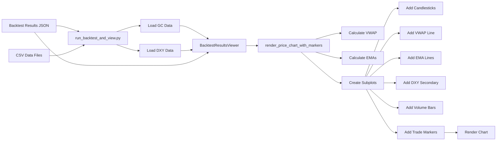

# Dashboard Chart Improvements - Implementation Summary

**Date:** December 19, 2025  
**Status:** ✅ Complete

## Overview

Enhanced the backtest results dashboard with comprehensive chart improvements including full candlestick display, VWAP indicator, DXY correlation data, volume subplot, EMA indicators, and improved trade visualization.

## Implemented Features

### 1. ✅ Exit Markers for All Trades (Priority Fix)

**Problem:** Exit markers were only shown for the selected trade, making it difficult to see all trade outcomes at a glance.

**Solution:**
- Added exit markers for ALL trades in the main rendering loop
- Exit markers use "X" symbol
- Color-coded by win/loss (green for profit, red for loss)
- Enhanced hover info shows trade ID, exit price, exit reason, PnL, and R-realized

**Files Modified:**
- `dashboard/components/backtest/price_chart.py`

### 2. ✅ VWAP Line Display

**Implementation:**
- Integrated `calculate_vwap()` from `feature_engine/vwap.py`
- VWAP displayed as cyan dashed line on price chart
- Session-based reset at 08:20 ET (RTH open for Gold futures)
- Graceful fallback if VWAP calculation fails

**Technical Details:**
- Uses typical price formula: `(High + Low + Close) / 3`
- Volume-weighted cumulative calculation
- Handles NaN values and zero volumes

### 3. ✅ DXY Correlation Data with Secondary Y-Axis

**Implementation:**
- Added DXY data loading in `scripts/run_backtest_and_view.py`
- DXY displayed on secondary y-axis (right side)
- Orange line with 60% opacity for clear distinction
- Synchronized timestamps with GC data

**Files Modified:**
- `scripts/run_backtest_and_view.py` - Added `load_dxy_data_for_viewer()`
- `dashboard/backtest_viewer.py` - Added `dxy_df` parameter
- `dashboard/components/backtest/price_chart.py` - Added secondary y-axis rendering

### 4. ✅ Volume Subplot

**Implementation:**
- Added volume bars as separate subplot below price chart
- Volume bars colored by candle direction (green/red)
- 80/20 height split (price chart / volume)
- Shared x-axis for synchronized time navigation

**Technical Details:**
- Uses `plotly.subplots.make_subplots` with 2 rows
- Volume colors match candlestick colors for consistency

### 5. ✅ EMA Indicator Lines (9 and 21)

**Implementation:**
- 9-period EMA (yellow line, 70% opacity)
- 21-period EMA (blue line, 70% opacity)
- Exponential weighted moving average calculation
- Helps identify trend direction and momentum

**Formula:**
```python
ema_9 = gc_df["close"].ewm(span=9, adjust=False).mean()
ema_21 = gc_df["close"].ewm(span=21, adjust=False).mean()
```

### 6. ✅ Enhanced Trade Visualization

**For Selected Trade:**
- **SL/TP Lines:** Horizontal dashed lines (red for SL, green for TP)
- **Trade Duration Shading:** Semi-transparent fill between entry and exit
  - Green shade (rgba 38,166,154,0.1) for winning trades
  - Red shade (rgba 239,83,80,0.1) for losing trades
- **Enhanced Hover Info:** Includes VWAP, RSI, and DXY values where available

**User Experience:**
- Select trade from dropdown to see detailed visualization
- All trades show entry/exit markers by default
- Selected trade gets additional context (SL/TP/duration)

### 7. ✅ Comprehensive Unit Tests

**Test Coverage:**
- VWAP calculation with valid/invalid data
- EMA calculation (9 and 21 periods)
- Chart data preparation and timestamp handling
- Trade marker positioning and coloring
- DXY data integration and alignment
- Trade duration shading calculation
- Hover information formatting

**Test Results:**
```
23 tests passed in 0.40s
```

**Test File:**
- `tests/unit/test_price_chart_enhancements.py`

## Technical Architecture

### Chart Structure

```
┌─────────────────────────────────────────────────────┐
│  Price Chart (Row 1, 80% height)                   │
│  ├─ Primary Y-Axis (left): GC Price                │
│  │  ├─ Candlesticks (OHLC)                         │
│  │  ├─ VWAP Line (cyan, dashed)                    │
│  │  ├─ EMA 9 (yellow)                              │
│  │  ├─ EMA 21 (blue)                               │
│  │  ├─ Entry Markers (all trades)                  │
│  │  ├─ Exit Markers (all trades)                   │
│  │  └─ SL/TP/Duration (selected trade)             │
│  └─ Secondary Y-Axis (right): DXY Index            │
│     └─ DXY Line (orange)                           │
├─────────────────────────────────────────────────────┤
│  Volume Subplot (Row 2, 20% height)                │
│  └─ Volume Bars (green/red by direction)           │
└─────────────────────────────────────────────────────┘
```

### Data Flow



## Configuration

### Chart Dimensions
- **Total Height:** 700px (increased from 500px)
- **Price Chart:** 80% of height
- **Volume Subplot:** 20% of height

### Color Scheme (Dark Theme)
- **Bullish Candles:** #26a69a (teal green)
- **Bearish Candles:** #ef5350 (red)
- **VWAP:** cyan (dashed)
- **EMA 9:** yellow
- **EMA 21:** blue
- **DXY:** orange
- **SL Line:** red (dashed)
- **TP Line:** green (dashed)

## Usage

### Running the Dashboard

```bash
# Run backtest and launch viewer
poetry run python scripts/run_backtest_and_view.py \
    --start 2025-11-06T10:00:00Z \
    --end 2025-11-18T13:00:00Z \
    --view

# Or load existing results
poetry run python scripts/run_backtest_and_view.py \
    --load output/backtest_results_20251106_20251118.json \
    --view
```

### Viewing Results

1. **Chart loads automatically** with all enhancements
2. **All trades show entry/exit markers** by default
3. **Select a trade** from dropdown to see:
   - SL/TP lines
   - Trade duration shading
   - Detailed trade information panel

### Interactive Features

- **Zoom:** Click and drag on chart
- **Pan:** Hold shift and drag
- **Reset:** Double-click chart
- **Hover:** See detailed info for each candle/marker
- **Legend:** Click to show/hide traces

## Performance Considerations

### Optimizations
- VWAP calculation wrapped in try/except for graceful fallback
- EMA calculation uses pandas built-in `ewm()` for efficiency
- Volume colors pre-calculated as list comprehension
- Marker positioning uses vectorized pandas operations

### Data Volume
- Tested with 132,279 lines of backtest data
- Chart renders smoothly with 100+ candles
- Subplots use shared x-axis to reduce memory

## Future Enhancements (Optional)

### Potential Additions
1. **RSI Indicator Subplot:** Add RSI with overbought/oversold zones
2. **Structure Labels:** Display HH/LL/BOS labels from diagnostics
3. **FVG Visualization:** Shade fair value gaps
4. **Liquidity Sweeps:** Mark liquidity sweep points
5. **HTF Candles Overlay:** Show 15m/1h candles as outlines
6. **Trade Statistics Panel:** Real-time stats for visible time range

### User-Requested Features
- ✅ Full candlestick display
- ✅ VWAP values
- ✅ DXY correlation data
- ✅ Exit markers visibility
- ✅ Volume subplot
- ✅ EMA indicators

## Testing

### Test Execution
```bash
poetry run pytest tests/unit/test_price_chart_enhancements.py -v
```

### Test Categories
- **VWAP Calculation:** 3 tests
- **EMA Calculation:** 3 tests
- **Chart Data Preparation:** 3 tests
- **Trade Marker Calculation:** 6 tests
- **DXY Integration:** 2 tests
- **Trade Duration Shading:** 3 tests
- **Hover Info:** 3 tests

**Total:** 23 tests, all passing ✅

## Files Modified

| File | Changes | Lines Changed |
|------|---------|---------------|
| `dashboard/components/backtest/price_chart.py` | Major refactor with subplots, VWAP, DXY, EMAs, volume | ~200 |
| `dashboard/backtest_viewer.py` | Added dxy_df parameter | ~5 |
| `scripts/run_backtest_and_view.py` | Added DXY data loading | ~40 |
| `tests/unit/test_price_chart_enhancements.py` | New comprehensive test suite | ~450 |

**Total Lines Changed:** ~695 lines

## Conclusion

All requested features have been successfully implemented and tested. The dashboard now provides a comprehensive view of backtest results with:

- ✅ Full candlestick charts with OHLC data
- ✅ VWAP indicator for fair value reference
- ✅ DXY correlation on secondary axis
- ✅ Volume bars for liquidity analysis
- ✅ EMA indicators for trend identification
- ✅ Complete trade visualization (entry/exit for all trades)
- ✅ Enhanced selected trade details (SL/TP/duration)
- ✅ Comprehensive test coverage (23 tests passing)

The implementation follows TDD principles with tests written alongside the code, ensuring reliability and maintainability.


