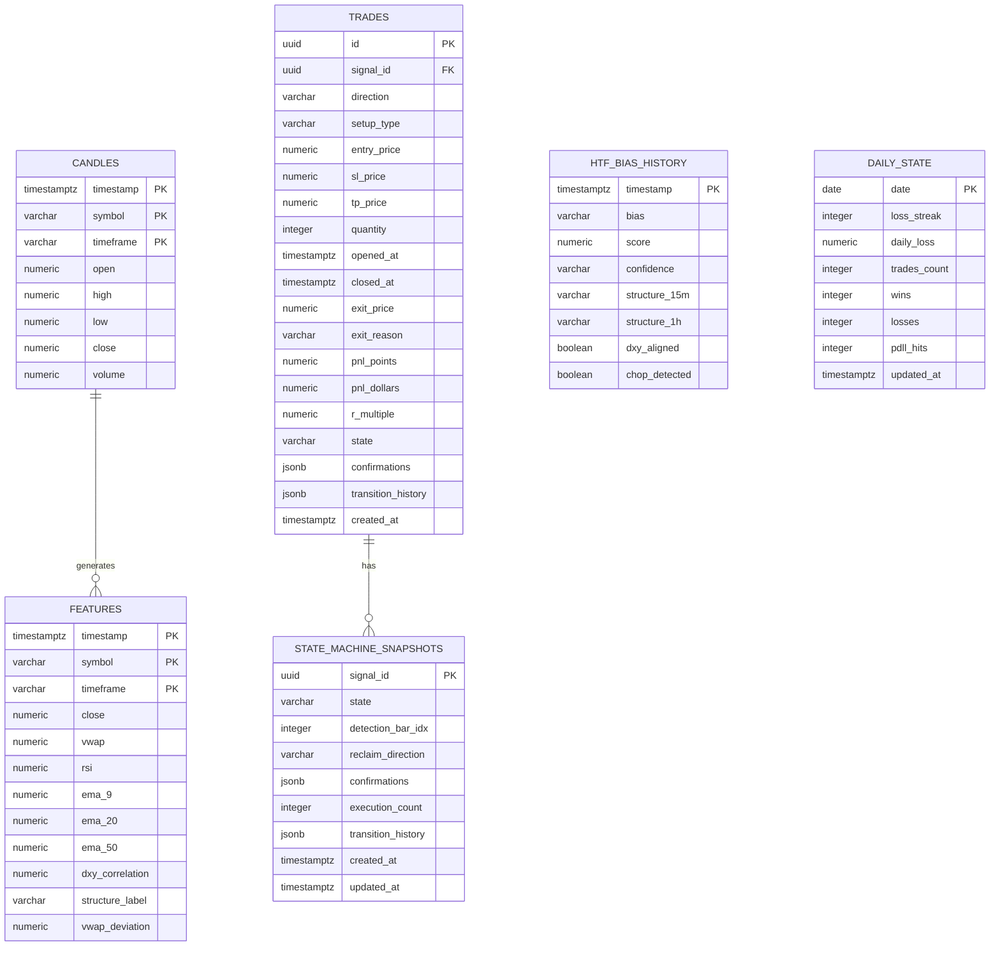

# Database Schema Chart

This document provides a visual representation of the database schema for the SCP microservices architecture.

## Entity Relationship Diagram



## Table Details

### 1. `candles` (TimescaleDB Hypertable)
**Purpose:** Stores OHLCV candle data for all symbols and timeframes.

| Column | Type | Constraints | Description |
|--------|------|-------------|-------------|
| `timestamp` | TIMESTAMPTZ | PK, NOT NULL | Candle timestamp |
| `symbol` | VARCHAR(10) | PK, NOT NULL | Symbol (e.g., 'GC', 'DXY') |
| `timeframe` | VARCHAR(5) | PK, NOT NULL | Timeframe (e.g., '1m', '15m', '1h') |
| `open` | NUMERIC(12,4) | NOT NULL | Opening price |
| `high` | NUMERIC(12,4) | NOT NULL | High price |
| `low` | NUMERIC(12,4) | NOT NULL | Low price |
| `close` | NUMERIC(12,4) | NOT NULL | Closing price |
| `volume` | NUMERIC(18,2) | NOT NULL | Volume |

**Primary Key:** `(timestamp, symbol, timeframe)`

**Indexes:**
- Hypertable automatically optimized for time-range queries

**Used By:**
- Data Adapter Service (writes)
- Feature Engine Service (reads for warmup)

---

### 2. `features` (TimescaleDB Hypertable)
**Purpose:** Stores computed technical indicators and features for warmup recovery.

| Column | Type | Constraints | Description |
|--------|------|-------------|-------------|
| `timestamp` | TIMESTAMPTZ | PK, NOT NULL | Feature timestamp |
| `symbol` | VARCHAR(10) | PK, NOT NULL | Symbol |
| `timeframe` | VARCHAR(5) | PK, NOT NULL | Timeframe |
| `close` | NUMERIC(12,4) | NULL | Close price |
| `vwap` | NUMERIC(12,4) | NULL | Volume Weighted Average Price |
| `rsi` | NUMERIC(6,2) | NULL | Relative Strength Index |
| `ema_9` | NUMERIC(12,4) | NULL | 9-period EMA |
| `ema_20` | NUMERIC(12,4) | NULL | 20-period EMA |
| `ema_50` | NUMERIC(12,4) | NULL | 50-period EMA |
| `dxy_correlation` | NUMERIC(5,3) | NULL | DXY correlation coefficient |
| `structure_label` | VARCHAR(20) | NULL | Structure label (HH/HL/LH/LL, BOS, CHoCH) |
| `vwap_deviation` | NUMERIC(8,4) | NULL | Deviation from VWAP |

**Primary Key:** `(timestamp, symbol, timeframe)`

**Indexes:**
- Hypertable automatically optimized for time-range queries

**Used By:**
- Feature Engine Service (writes, reads for warmup)
- Bot Core Service (reads for historical analysis)

---

### 3. `htf_bias_history` (TimescaleDB Hypertable)
**Purpose:** Stores higher-timeframe bias calculations over time.

| Column | Type | Constraints | Description |
|--------|------|-------------|-------------|
| `timestamp` | TIMESTAMPTZ | PK, NOT NULL | Bias calculation timestamp |
| `bias` | VARCHAR(10) | NOT NULL | Bias direction: 'bullish', 'bearish', 'neutral' |
| `score` | NUMERIC(4,2) | NOT NULL | Bias score (0-10) |
| `confidence` | VARCHAR(10) | NOT NULL | Confidence level |
| `structure_15m` | VARCHAR(20) | NULL | 15m structure label |
| `structure_1h` | VARCHAR(20) | NULL | 1h structure label |
| `dxy_aligned` | BOOLEAN | NULL | Whether DXY aligns with bias |
| `chop_detected` | BOOLEAN | NULL | Whether choppy market detected |

**Primary Key:** `timestamp`

**Indexes:**
- Hypertable automatically optimized for time-range queries

**Used By:**
- HTF Bias Service (writes)
- Bot Core Service (reads for historical analysis)

---

### 4. `trades` (Standard PostgreSQL Table)
**Purpose:** Full audit trail of all trades (opened, closed, invalidated).

| Column | Type | Constraints | Description |
|--------|------|-------------|-------------|
| `id` | UUID | PK, DEFAULT | Trade unique identifier |
| `signal_id` | UUID | NOT NULL, FK | Reference to signal that generated trade |
| `direction` | VARCHAR(10) | NOT NULL | 'long' or 'short' |
| `setup_type` | VARCHAR(30) | NOT NULL | Setup type (e.g., 'VWAP_RECLAIM') |
| `entry_price` | NUMERIC(12,4) | NOT NULL | Entry price |
| `sl_price` | NUMERIC(12,4) | NOT NULL | Stop loss price |
| `tp_price` | NUMERIC(12,4) | NOT NULL | Take profit price |
| `quantity` | INTEGER | NOT NULL | Number of contracts |
| `opened_at` | TIMESTAMPTZ | NOT NULL | Trade open timestamp |
| `closed_at` | TIMESTAMPTZ | NULL | Trade close timestamp (NULL if open) |
| `exit_price` | NUMERIC(12,4) | NULL | Exit price (NULL if open) |
| `exit_reason` | VARCHAR(30) | NULL | Exit reason (SL, TP, INVALIDATED, MANUAL) |
| `pnl_points` | NUMERIC(8,2) | NULL | P&L in points |
| `pnl_dollars` | NUMERIC(12,2) | NULL | P&L in dollars |
| `r_multiple` | NUMERIC(4,2) | NULL | Risk multiple (R) |
| `state` | VARCHAR(20) | NOT NULL, DEFAULT 'OPEN' | Trade state: OPEN, CLOSED, INVALIDATED |
| `confirmations` | JSONB | NULL | State machine confirmations |
| `transition_history` | JSONB | NULL | State machine transition history |
| `created_at` | TIMESTAMPTZ | DEFAULT NOW() | Record creation timestamp |

**Primary Key:** `id`

**Indexes:**
- `idx_trades_state` on `state` (for querying open trades)
- `idx_trades_opened_at` on `opened_at` (for time-range queries)

**Used By:**
- Execution Service (writes, reads for recovery)
- Bot Core Service (reads for daily state calculation)

---

### 5. `state_machine_snapshots` (Standard PostgreSQL Table)
**Purpose:** Persists VWAP Reclaim state machine state for recovery.

| Column | Type | Constraints | Description |
|--------|------|-------------|-------------|
| `signal_id` | UUID | PK | Signal ID (links to trade.signal_id) |
| `state` | VARCHAR(20) | NOT NULL | Current state machine state |
| `detection_bar_idx` | INTEGER | NULL | Bar index where reclaim detected |
| `reclaim_direction` | VARCHAR(10) | NULL | Reclaim direction ('long' or 'short') |
| `confirmations` | JSONB | NULL | Confirmation tracking data |
| `execution_count` | INTEGER | DEFAULT 0 | Number of executions |
| `transition_history` | JSONB | NULL | History of state transitions |
| `created_at` | TIMESTAMPTZ | DEFAULT NOW() | Record creation timestamp |
| `updated_at` | TIMESTAMPTZ | DEFAULT NOW() | Last update timestamp |

**Primary Key:** `signal_id`

**Used By:**
- Execution Service (writes, reads for recovery)

---

### 6. `daily_state` (Standard PostgreSQL Table)
**Purpose:** Tracks daily trading statistics for Bot Core guardrails.

| Column | Type | Constraints | Description |
|--------|------|-------------|-------------|
| `date` | DATE | PK | Trading date |
| `loss_streak` | INTEGER | DEFAULT 0 | Consecutive loss count |
| `daily_loss` | NUMERIC(12,2) | DEFAULT 0 | Total daily loss in dollars |
| `trades_count` | INTEGER | DEFAULT 0 | Total trades today |
| `wins` | INTEGER | DEFAULT 0 | Winning trades count |
| `losses` | INTEGER | DEFAULT 0 | Losing trades count |
| `pdll_hits` | INTEGER | DEFAULT 0 | Pre-Determined Loss Limit hits |
| `updated_at` | TIMESTAMPTZ | DEFAULT NOW() | Last update timestamp |

**Primary Key:** `date`

**Used By:**
- Bot Core Service (writes, reads for guardrails)

---

## Relationships

1. **Candles → Features**: One-to-many relationship based on `(timestamp, symbol, timeframe)`
   - Features are computed from candles
   - Used for warmup recovery in Feature Engine

2. **Features → HTF Bias History**: One-to-many relationship based on `timestamp`
   - HTF bias is computed from higher-timeframe features
   - Multiple bias calculations can occur per timestamp

3. **Trades → State Machine Snapshots**: One-to-one relationship via `signal_id`
   - Each trade has one associated state machine snapshot
   - State machine tracks the execution lifecycle

---

## TimescaleDB Hypertables

The following tables are converted to TimescaleDB hypertables for efficient time-series queries:

- `candles` - Partitioned by `timestamp`
- `features` - Partitioned by `timestamp`
- `htf_bias_history` - Partitioned by `timestamp`

**Benefits:**
- Automatic time-based partitioning
- Efficient time-range queries
- Compression for older data
- Continuous aggregates support

---

## Data Flow

```
Data Adapter
    ↓ writes
candles
    ↓ reads
Feature Engine
    ↓ writes
features
    ↓ reads
HTF Bias Service
    ↓ writes
htf_bias_history
    ↓ reads
Bot Core
    ↓ writes
daily_state
    ↓ generates signals
Execution Service
    ↓ writes
trades
    ↓ writes
state_machine_snapshots
```

---

## Recovery Scenarios

### Feature Engine Recovery
- Reads last N candles from `candles` table
- Replays to rebuild indicator buffers
- Minimum warmup: ~60 bars for DXY correlation

### HTF Bias Service Recovery
- Reads last 24h of features from `features` table
- Rebuilds structure context and bias state

### Bot Core Recovery
- Reads `daily_state` for current date
- Loads loss streak, daily loss, trade counts
- Caches last HTF bias from stream (no DB read needed)

### Execution Service Recovery
- **Critical**: Reads all OPEN trades from `trades` table
- Reads `state_machine_snapshots` for active signals
- Reconciles with broker positions
- Restores active trade monitoring

---

## Indexes Summary

| Table | Index | Purpose |
|-------|-------|---------|
| `candles` | Primary Key (timestamp, symbol, timeframe) | Unique candle lookup |
| `features` | Primary Key (timestamp, symbol, timeframe) | Unique feature lookup |
| `htf_bias_history` | Primary Key (timestamp) | Unique bias lookup |
| `trades` | Primary Key (id) | Unique trade lookup |
| `trades` | `idx_trades_state` | Query open/closed trades |
| `trades` | `idx_trades_opened_at` | Time-range queries |
| `state_machine_snapshots` | Primary Key (signal_id) | Unique state machine lookup |
| `daily_state` | Primary Key (date) | Daily state lookup |

---

## Notes

- All timestamps use `TIMESTAMPTZ` (timezone-aware) for consistency
- JSONB columns (`confirmations`, `transition_history`) allow flexible schema evolution
- UUIDs are used for trade and signal IDs for distributed system compatibility
- TimescaleDB hypertables provide automatic partitioning and compression
- Foreign key relationship between `trades.signal_id` and `state_machine_snapshots.signal_id` is logical (not enforced by DB constraint for flexibility)

